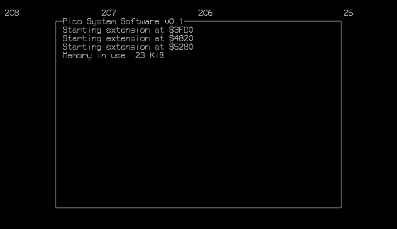
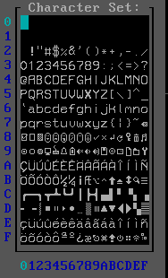

# Pico System Software

TUI Operating System for IBM PC or Compatible.

### Pico System Font

- 0x00-0x1f: Application use
- 0x20-0xff: Common Font

### Minimum Reqs

- PC or Compatible
- Floppy Drive
- 192 KiB RAM
- EGA Video Card or Compatible

### Features

- Cooperative Multitask
- Microkernel

### Version History

- [Pico System v0.1](https://github.com/humbertocsjr/picosystem/releases/tag/picosystem-v0.1) \
    
    - Add Cothreads
    - Add System Font
    - Add Boot Loader Stage1/Stage2
    - Add Minimal B++ Standard Library

# Pico System ABI Specs

### ABI Registers:

- AX: Command ID
- BX: Argument 0
- CX: Argument 1
- DX: Argument 2
- SI: Argument 3

### Interrupts

_Format: COMMAND(ARGUMENTS,...)_

- INT 0x80: Task Yield
- INT 0x81: Kernel
    - 0x00(result_value): exit cothread,
    - 0x01(code_seg, code_off, data_seg, stack_top): start new cothread