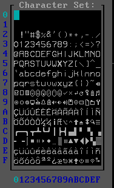

# Pico Softwares

- [Pico System Software](docs/pico.md) \
    Operating System for IBM PC
- [Pico Software Development Kit](docs/sdk.md) \
    SDK for 8086 \
    Packages:
    - .deb: Debian/Ubuntu
    - .rpm: Fedora/Red Hat
    - .zip: Windows
- [B++ Language](docs/bpp.md) \
    Modernized B Language for RetroComputing Projects
- [Pico System Font](docs/pico.md) \
    

## How to generate Pico SDK/B++ Packages

- Install C Development Kit/NASM for your linux
    - Debian/Ubuntu
        ```sh
        sudo apt install build-essential nasm crossbuild-essential-arm64 crossbuild-essential-i386 mingw-w64 mingw-w64-i686-dev  mingw-w64-x86-64-dev alien zip
        ```
- Generate packages
    ```sh
    make packages
    ```

## How to install Pico SDK/B++ Compiler
<a id="sdk-prereqs"></a>
- Install C Development Kit/NASM for your linux
    - Debian/Ubuntu
        ```sh
        sudo apt install build-essential nasm crossbuild-essential-arm64 crossbuild-essential-i386 mingw-w64 mingw-w64-i686-dev  mingw-w64-x86-64-dev alien zip
        ```
- Compile Pico SDK
    ```sh
    make sdk
    ```
- Install Pico SDK
    ```sh
    sudo make install
    ```

## Run Pico System Software on Emulator

- Install [SDK/B++](#sdk-prereqs) prerequisites
- Install QEMU
- Execute emulator
```sh
make run
```
